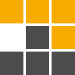
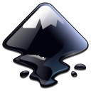

# Heya!

I'm Mai, a hands-on developer navigating the dynamic world of software. Neovim
and VSCode are my go-to for creating efficient coding spaces. From HTML to TypeScript,
I thrive in frontend magic. Linux is my playground, juggling between Arch and Gentoo.
Whether it's C, Python, or crafting sleek interfaces with React and TailwindCSS,
I love the process.

Let's be real, I'm no master, and that's alright. I enjoy breaking things, figuring
stuff out, and embracing every challenge for constant growth. It's this willingness
to learn and grow that keeps me going. Each challenge is an opportunity to get
better, and I'm all about that constant improvement.

## Languages and Tools:

    

        
    

    

        
    

    

        
    

    

        
    

    

        
    

    

        
    

    

        
    

    

        
    

    

        
    

 

    

        
    

    

        
    

    

        
    

    

        
    

    

        
    

    

        
    

    

        
    

    

        
    

    

        
    

 

## Currently Learning:

    

        
    

    

        
    

    

        
    

    

        
    

    

        
    

<!---
DefinitelyNotMai/DefinitelyNotMai is a ✨ special ✨ repository because its `README.md` (this file) appears on your GitHub profile.
You can click the Preview link to take a look at your changes.
--->
